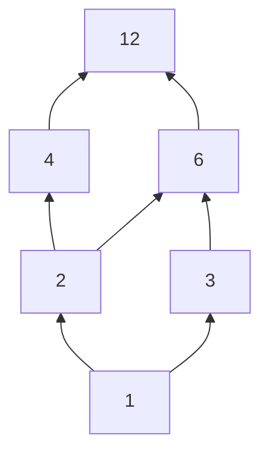

# Chương 3: Quan hệ hai ngôi

[TOC]

## 1. Định nghĩa Quan hệ hai ngôi

Quan hệ là một khái niệm cơ bản trong toán học và đời sống, dùng để mô tả mối liên kết giữa các đối tượng. Ví dụ: quan hệ giữa nhân viên và mức lương, giữa quản lý và cấp dưới, giữa giá trị hàng hóa và tỉ lệ khuyến mãi, v.v.

### 1.1. Định nghĩa tổng quát

> **Định nghĩa**: Cho hai tập hợp $A$ và $B$. Một **quan hệ hai ngôi** $R$ từ $A$ đến $B$ là một tập hợp con của tích Descartes $A \times B$.
> $$ R \subseteq A \times B $$
> Nếu cặp $(a, b) \in R$, ta nói $a$ có quan hệ $R$ với $b$ và ký hiệu là $aRb$.
> Nếu cặp $(a, b) \notin R$, ta nói $a$ không có quan hệ $R$ với $b$ và ký hiệu là $a \not\mathrel{R} b$.

**Ví dụ:** Cho tập sinh viên $S = \{a, b, c\}$ và tập các chương của môn Toán Rời Rạc $D = \{l, c, s, g\}$. Quan hệ $R$ "sinh viên $x$ đã ôn thi chương $y$" được cho bởi bảng sau:

| R | l | c | s | g |
| :-: | :-: | :-: | :-: | :-: |
| **a** | | x | x | |
| **b** | | | x | x |
| **c** | x | | | x |

Khi đó, quan hệ $R$ là tập hợp các cặp: $R = \{(a,c), (a,s), (b,s), (b,g), (c,l), (c,g)\}$.

### 1.2. Quan hệ trên một tập hợp

> Một trường hợp đặc biệt và quan trọng là quan hệ trên chính một tập hợp $A$. Khi đó, quan hệ $R$ là một tập con của $A \times A$.
> $$ R \subseteq A \times A $$

**Ví dụ:** Cho tập $A = \{1, 5, 3, 6\}$. Xét quan hệ $R$ trên $A$ được định nghĩa là "$a$ chia hết cho $b$", hay $R = \{(a,b) \in A \times A \mid a \vdots b\}$.

Ta có:
$R = \{(1,1), (5,1), (5,5), (3,1), (3,3), (6,1), (6,3), (6,6)\}$.

## 2. Các tính chất của Quan hệ

Xét một quan hệ $R$ trên tập hợp $A$.

### 2.1. Tính phản xạ (Reflexive)
> Quan hệ $R$ được gọi là có **tính phản xạ** nếu mọi phần tử đều có quan hệ với chính nó.
> $$ \forall a \in A, (a,a) \in R $$

**Ví dụ:** Cho $A = \{1, 2, 3\}$.
- $R_1 = \{(1,1), (2,2), (3,3), (1,2), (3,2)\}$ là quan hệ phản xạ.
- $R_2 = \{(1,2), (2,2), (2,3), (3,3)\}$ không phản xạ vì $(1,1) \notin R_2$.

### 2.2. Tính đối xứng (Symmetric) và Phản đối xứng (Antisymmetric)

#### Tính đối xứng
> Quan hệ $R$ có **tính đối xứng** nếu với mọi cặp $(a,b)$, nếu $a$ có quan hệ với $b$ thì $b$ cũng có quan hệ với $a$.
> $$ \forall a, b \in A, (a,b) \in R \implies (b,a) \in R $$

**Ví dụ:** Cho $A = \{1, 2, 3\}$.
- $R = \{(1,2), (2,1), (1,1), (2,2)\}$ có tính đối xứng.
- $R' = \{(1,2), (2,3), (3,2)\}$ không đối xứng vì $(1,2) \in R'$ nhưng $(2,1) \notin R'$.

#### Tính phản đối xứng
> Quan hệ $R$ có **tính phản đối xứng** nếu với hai phần tử phân biệt $a$ và $b$, không thể có đồng thời $a$ quan hệ với $b$ và $b$ quan hệ với $a$.
> $$ \forall a, b \in A, ((a,b) \in R \land (b,a) \in R) \implies a = b $$

**Ví dụ:** Quan hệ "$\le$" trên tập số thực là phản đối xứng, vì nếu $a \le b$ và $b \le a$ thì suy ra $a=b$.

### 2.3. Tính bắc cầu (Transitive)
> Quan hệ $R$ có **tính bắc cầu** nếu $a$ có quan hệ với $b$ và $b$ có quan hệ với $c$, thì $a$ cũng có quan hệ với $c$.
> $$ \forall a, b, c \in A, ((a,b) \in R \land (b,c) \in R) \implies (a,c) \in R $$

**Ví dụ:** Cho $A = \{1, 2, 3\}$.
- $R = \{(1,2), (2,3), (1,3)\}$ có tính bắc cầu.
- $R' = \{(1,2), (2,1)\}$ không có tính bắc cầu vì $(1,2) \in R'$ và $(2,1) \in R'$, nhưng $(1,1) \notin R'$.

## 3. Biểu diễn Quan hệ

### 3.1. Biểu diễn bằng ma trận
Cho quan hệ $R$ từ tập $A = \{a_1, ..., a_m\}$ đến $B = \{b_1, ..., b_n\}$. Ta có thể biểu diễn $R$ bằng một ma trận zero-one $M_R$ cấp $m \times n$, với các phần tử $m_{ij}$ được xác định như sau:
$$
m_{ij} =
\begin{cases}
1 & \text{nếu } (a_i, b_j) \in R \\
0 & \text{nếu } (a_i, b_j) \notin R
\end{cases}
$$

**Ví dụ:** Cho $A = \{1,2,3,4\}$, $B=\{5,6,7\}$ và $R = \{(1,5), (2,6), (2,7), (4,7)\}$.
Ma trận biểu diễn $M_R$ là:
$$
M_R =
\begin{bmatrix}
1 & 0 & 0 \\
0 & 1 & 1 \\
0 & 0 & 0 \\
0 & 0 & 1
\end{bmatrix}
$$

### 3.2. Biểu diễn bằng đồ thị có hướng (Digraph)
> Note: Chỉ dùng khi A x A

Khi $R$ là một quan hệ trên một tập hợp $A$, ta có thể biểu diễn nó bằng một đồ thị có hướng $G=(V,E)$ trong đó:
- Tập đỉnh $V$ là tập hợp $A$.
- Tập cung $E$ gồm các cung $(a,b)$ nếu và chỉ nếu $(a,b) \in R$.

**Ví dụ:** Cho $A = \{1,2,3,4\}$ và $R=\{(1,1), (1,3), (2,1), (2,3), (2,4), (3,1), (3,2), (4,1)\}$.

Đồ thị có hướng biểu diễn quan hệ này sẽ có 4 đỉnh là 1, 2, 3, 4 và các cung tương ứng như $(1,1), (1,3)$, v.v.

## 4. Các loại Quan hệ đặc biệt

### 4.1. Quan hệ tương đương (Equivalence Relation)
> **Định nghĩa**: Một quan hệ $R$ trên tập $A$ được gọi là **quan hệ tương đương** nếu nó thỏa mãn cả ba tính chất:
> 1.  Phản xạ (Reflexive)
> 2.  Đối xứng (Symmetric)
> 3.  Bắc cầu (Transitive)

**Ví dụ:** Quan hệ "đồng dư modulo 3" trên tập các số nguyên. Tức là $aRb \iff a \equiv b \pmod 3$.

#### Lớp tương đương
> Cho $R$ là một quan hệ tương đương trên $A$. Với mỗi $a \in A$, **lớp tương đương** của $a$, ký hiệu là $[a]$, là tập hợp tất cả các phần tử $x \in A$ có quan hệ với $a$.
> $$ [a] = \{x \in A \mid xRa\} $$
>
> Các lớp tương đương của một quan hệ tương đương tạo thành một **phân hoạch** của tập $A$ (chia $A$ thành các tập con không rỗng, rời nhau và hợp của chúng bằng $A$).

### 4.2. Quan hệ thứ tự (Partial Order Relation)
> **Định nghĩa**: Một quan hệ $R$ trên tập $A$ được gọi là **quan hệ thứ tự bộ phận** (hay quan hệ thứ tự) nếu nó thỏa mãn cả ba tính chất:
> 1.  Phản xạ (Reflexive)
> 2.  Phản đối xứng (Antisymmetric)
> 3.  Bắc cầu (Transitive)
> 
> Một tập hợp $A$ cùng với một quan hệ thứ tự $R$ trên nó, ký hiệu $(A,R)$, được gọi là một **tập được sắp thứ tự bộ phận** (poset).

**Ví dụ:** Quan hệ "chia hết" ($|$) trên tập các số nguyên dương $U_{12} = \{1,2,3,4,6,12\}$.

#### Biểu đồ Hasse
Biểu đồ Hasse là một cách biểu diễn đồ thị đơn giản hóa cho một quan hệ thứ tự.
- **Cách vẽ**:
  1. Bắt đầu từ đồ thị có hướng của quan hệ.
  2. Xóa các khuyên (vòng lặp tại mỗi đỉnh) do tính phản xạ.
  3. Xóa các cung bắc cầu.
  4. Sắp xếp các đỉnh sao cho nếu $aRb$ thì $a$ được vẽ thấp hơn $b$, và bỏ các mũi tên trên cung.

**Ví dụ:** Biểu đồ Hasse cho quan hệ "chia hết" trên $U_{12}$:

Vẽ như trong slide:

Vẽ bằng Mermaid:

